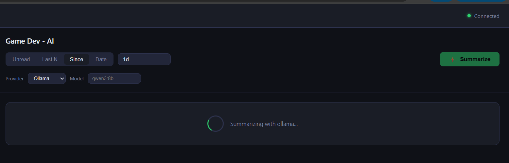

# wa_personal_summerizer

WhatsApp conversation summarizer powered by a local (or cloud) LLM. Summarize any chat in seconds — via the web UI, CLI, or by uploading an exported chat file.



---

## ✅ Recommended: Use Exported Chat Files (Legal & Safe)

The safest and fully legal way to use this tool is to **export your chats from WhatsApp** and summarize the file — no unofficial libraries, no account risk.

### How to export a chat from WhatsApp

**On iPhone:**
Settings → Chats → Export Chat → choose a chat → "Without Media" → save the `.txt` file

**On Android:**
Open a chat → ⋮ menu → More → Export Chat → "Without Media" → save the `.txt` file

### Summarize via web UI (recommended)

```bash
npm run web
# Open http://localhost:3030
# Click "Upload Chat Export (.txt)" at the top
```

### Summarize via CLI

```bash
wasumm parse "WhatsApp Chat with Family Group.txt" --last 50
wasumm parse "WhatsApp Chat with Work Team.txt" --since 1d
wasumm parse "WhatsApp Chat with John.txt" --from 2026-03-25
```

> **Note:** If WhatsApp gives you a `.zip` file, extract it and use the `_chat.txt` file inside.

---

## ⚡ Live Mode: Connect Directly (Unofficial)

> ⚠️ **This mode uses [whatsapp-web.js](https://github.com/pedroslopez/whatsapp-web.js), an unofficial client. It is not affiliated with or endorsed by WhatsApp/Meta and may violate their Terms of Service. Use at your own risk.** See [Disclaimer](#disclaimer) below.

Live mode connects to your WhatsApp account in real-time — no manual export needed.

```bash
wasumm summarize "Family Group" --since 1d
wasumm summarize "Work Team" --last 100
wasumm summarize "John" --unread
```

---

## Features

- **Two modes**: export file (legal ✅) or live connection (unofficial ⚠️)
- Summarize by **last N messages**, **last N hours/days**, **since a date**, or **unread messages**
- **Web UI** at `localhost:3030` — upload a file or browse live chats
- **Pluggable AI providers**: Ollama (local), OpenAI, Anthropic, or any OpenAI-compatible API
- **Private by default** — with Ollama, no data ever leaves your machine
- **Clipboard integration** — summary is automatically copied after display

---

## Prerequisites

- **Node.js** v18 or higher
- **WhatsApp** account (personal — no Business account needed)
- One of the following AI providers:
  - [Ollama](https://ollama.com) running locally *(recommended — free and private)*
  - OpenAI API key
  - Anthropic API key

---

## Installation

### 1. Clone the repository

```bash
git clone https://github.com/shaharbar2/wa_personal_summerizer.git
cd wasumm
```

### 2. Install dependencies

```bash
npm install
```

### 3. (Ollama only) Pull a model

```bash
ollama pull qwen3:8b
```

Any model works. `qwen3:8b` is a good balance of speed and quality for summarization.

### 4. First-time WhatsApp authentication

Run any command — it will display a QR code to scan with your phone:

```bash
node bin/wasumm.js chats
```

Open WhatsApp on your phone → **Settings → Linked Devices → Link a Device** → scan the QR code.

After the first scan, the session is saved locally and you won't need to scan again.

### 5. (Optional) Install globally

```bash
npm install -g .
wasumm chats
```

---

## Usage

### List your chats

```bash
wasumm chats
wasumm chats --limit 30
```

### Summarize a chat

```bash
# Last N messages
wasumm summarize "Family Group" --last 50

# Last N hours or days
wasumm summarize "Work Team" --since 2h
wasumm summarize "Work Team" --since 1d

# Since a specific date
wasumm summarize "John" --from 2026-03-25

# Unread messages only
wasumm summarize "Family Group" --unread

# Default (unread, fallback to last 20)
wasumm summarize "Family Group"
```

Chat names are **case-insensitive** and support partial matching. If multiple chats match, you'll be shown a list to choose from.

### Override provider or model on the fly

```bash
wasumm summarize "Work Team" --last 50 --provider openai --model gpt-4o
wasumm summarize "Family" --since 1d --provider anthropic --model claude-haiku-4-5-20251001
```

### Re-authenticate

If your WhatsApp session expires:

```bash
wasumm auth
```

---

## Configuration

Create `~/.wasumm/config.json` to set persistent defaults:

```json
{
  "provider": "ollama",
  "model": "qwen3:8b",
  "ollamaHost": "http://localhost:11434"
}
```

### OpenAI / OpenAI-compatible APIs

```json
{
  "provider": "openai",
  "model": "gpt-4o-mini",
  "apiKey": "sk-..."
}
```

Works with any OpenAI-compatible API (Groq, Together AI, LM Studio, etc.) by setting `openaiBaseUrl`:

```json
{
  "provider": "openai",
  "model": "llama3-70b-8192",
  "apiKey": "your-groq-key",
  "openaiBaseUrl": "https://api.groq.com/openai/v1"
}
```

### Anthropic Claude

```json
{
  "provider": "anthropic",
  "model": "claude-haiku-4-5-20251001",
  "apiKey": "sk-ant-..."
}
```

### Configuration options

| Key | Default | Description |
|-----|---------|-------------|
| `provider` | `ollama` | AI provider: `ollama`, `openai`, `anthropic` |
| `model` | `qwen3:8b` | Model name for the selected provider |
| `ollamaHost` | `http://localhost:11434` | Ollama server URL |
| `openaiBaseUrl` | `https://api.openai.com/v1` | Base URL for OpenAI-compatible APIs |
| `apiKey` | *(none)* | API key for cloud providers |
| `defaultScope` | `unread` | Default summarization scope |

---

## Project Structure

```
wasumm/
├── bin/
│   └── wasumm.js          # CLI entry point
├── src/
│   ├── cli.js             # Command definitions (commander)
│   ├── whatsapp.js        # WhatsApp client, message fetching
│   ├── formatter.js       # Message formatting for LLM input
│   ├── summarizer.js      # Provider router
│   ├── output.js          # Terminal output + clipboard
│   ├── config.js          # Config file loading
│   └── providers/
│       ├── ollama.js      # Ollama (local)
│       ├── openai.js      # OpenAI / OpenAI-compatible
│       └── anthropic.js   # Anthropic Claude
```

---

## Adding a New Provider

Create `src/providers/your-provider.js` with two exports:

```js
// Check that the provider is reachable and configured
export async function check(config) {
  // throw an Error with setup instructions if not ready
}

// Return a summary string
export async function summarize(formattedMessages, systemPrompt, config) {
  // call your API and return the summary text
}
```

Then register it in `src/summarizer.js`:

```js
import * as yourProvider from './providers/your-provider.js';
const PROVIDERS = { ollama, openai, anthropic, 'your-provider': yourProvider };
```

Use it with: `wasumm summarize "Chat" --provider your-provider`

---

## Disclaimer

> **This project uses [whatsapp-web.js](https://github.com/pedroslopez/whatsapp-web.js), an unofficial WhatsApp Web client. It is not affiliated with, endorsed by, or supported by WhatsApp or Meta.**
>
> Using unofficial clients may violate WhatsApp's [Terms of Service](https://www.whatsapp.com/legal/terms-of-service). Your account could potentially be banned, though the risk for personal use is generally low.
>
> **Use at your own risk.** This tool is intended for personal productivity only — not for bulk messaging, scraping, or any commercial or automated purpose.
>
> Message content processed with Ollama stays entirely on your device. With cloud providers (OpenAI, Anthropic), messages are sent to their APIs — review their privacy policies before use.

---

## License

MIT
